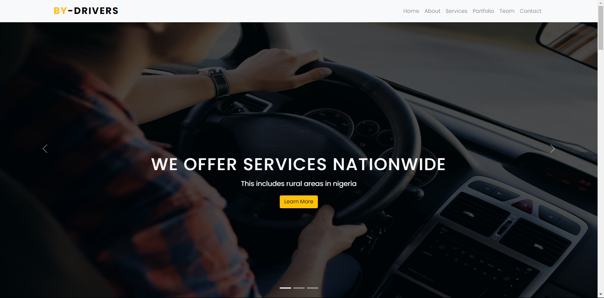
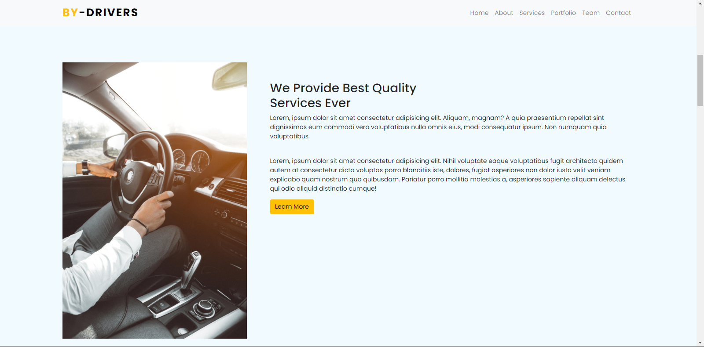
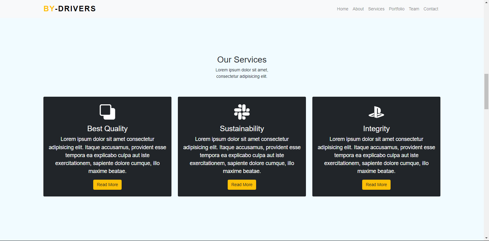
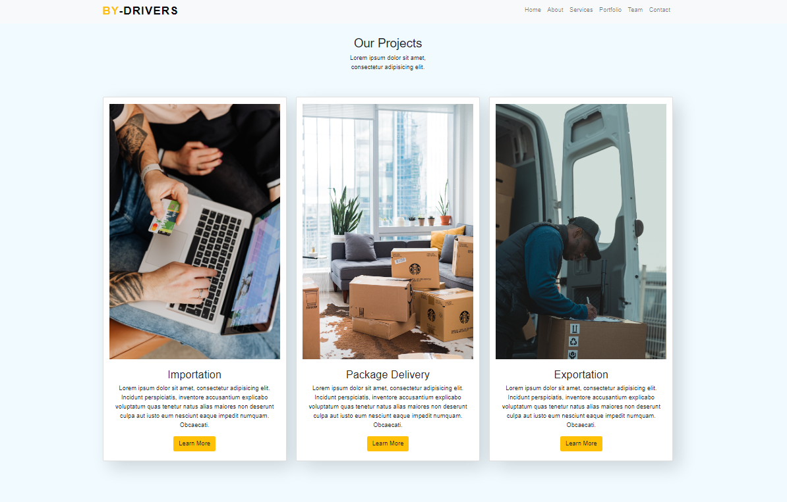
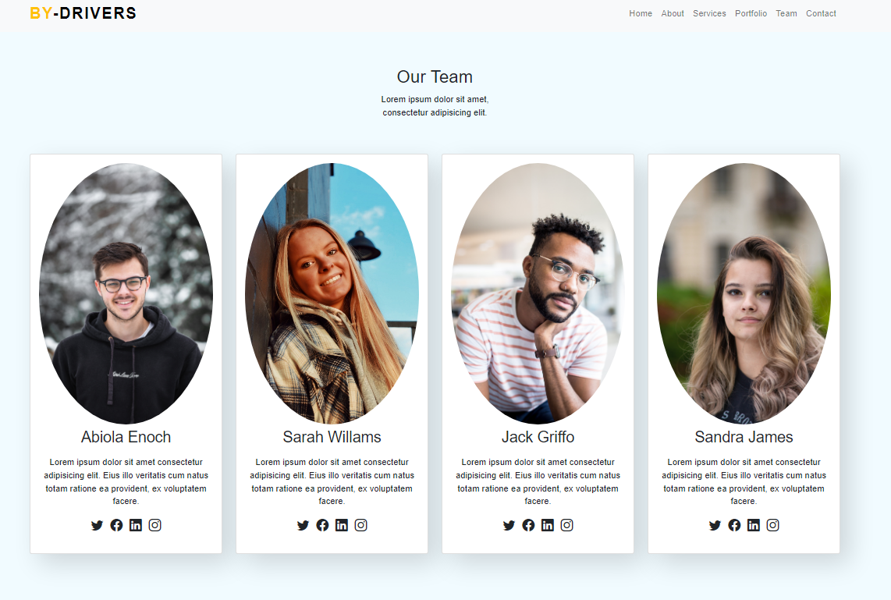
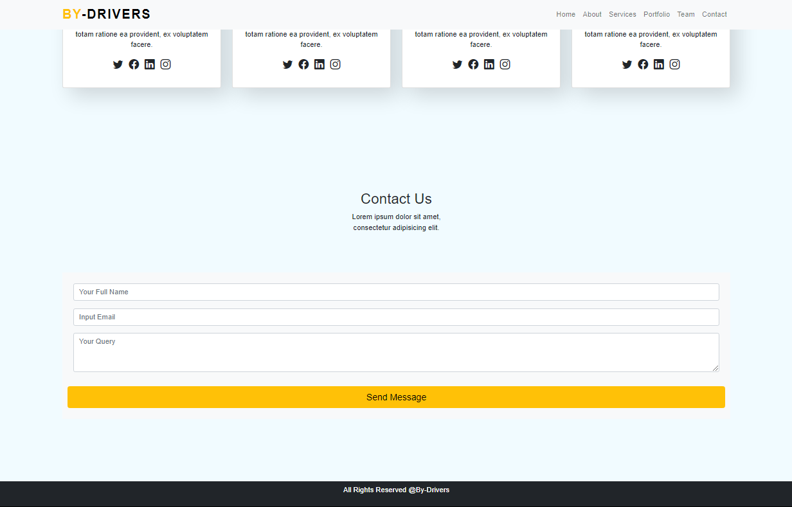

# By-Drivers-Website
This is a website design using HTML || CSS >> BOOTSTRAP and it consist of:
Homepage, About page, Services, Projects and Contacts

I will bse showing the screenshot of how the website looks like
<h3>Screenshots</h3>
1. Screenshot 1 (This is how the homepage looks like)
 
 

2. Screenshot 2 (This is the screenshot of the about page)
 

 
3. Screenshot 3 (This is how the service page looks like)
 

 

4. Screenshot 4 (This is the screenshot of the project page)
 

 
6. Screenshot 5 (This is the team page screenshot)
 

 

6. Screenshot 6 (This is the last screenshot of the website and it is the contact page screenshot)
 

This Is Desiged By <pre>Abiola Enoch God'slove</pre>

